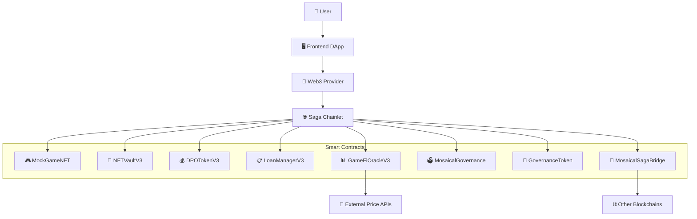
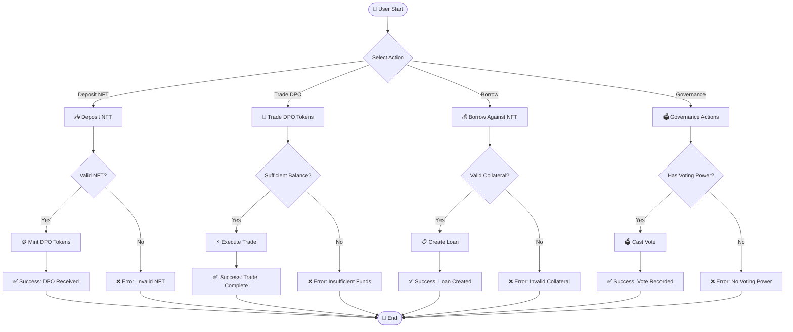
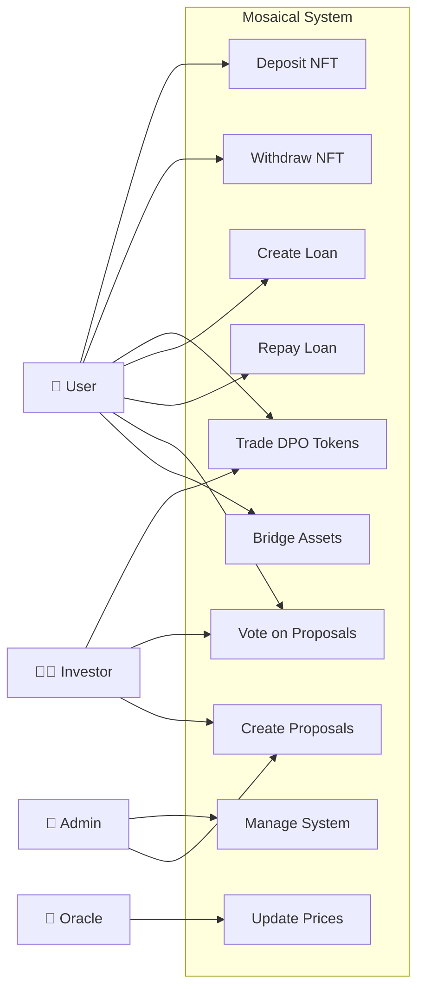
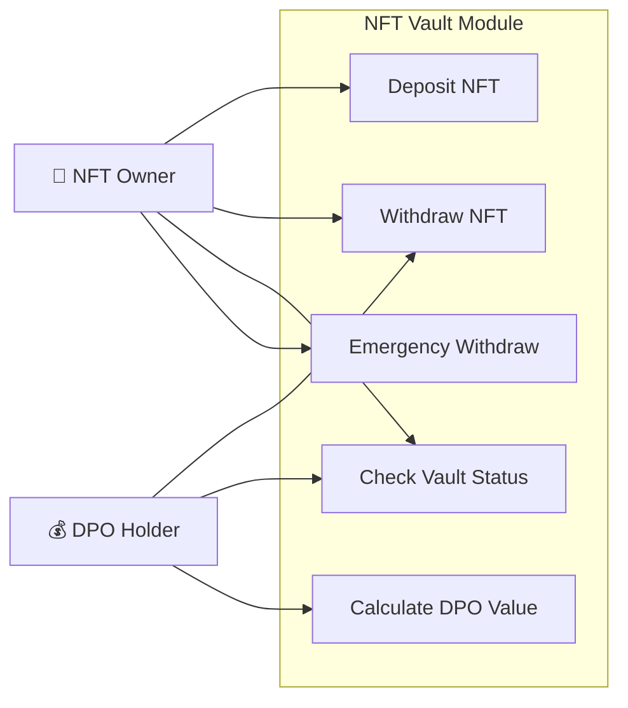
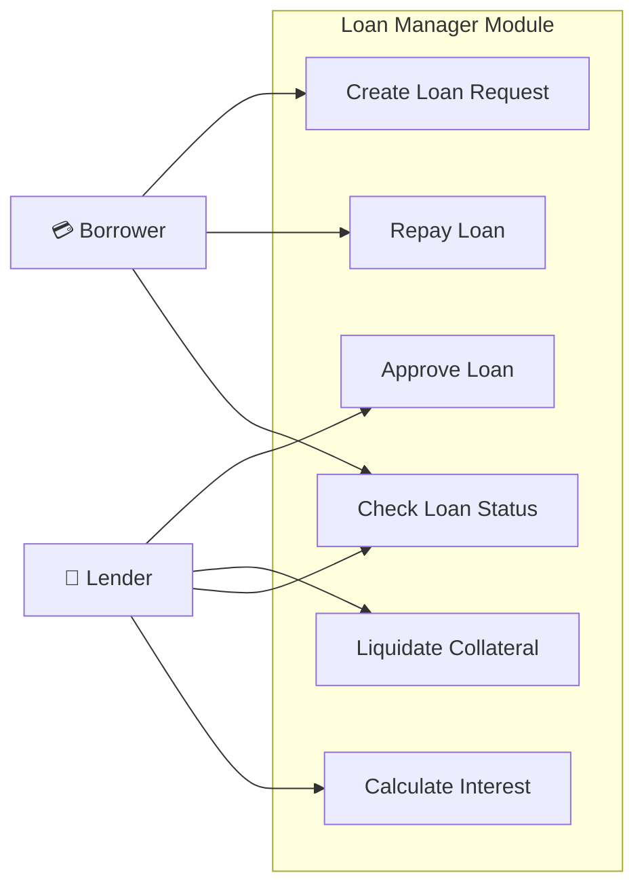
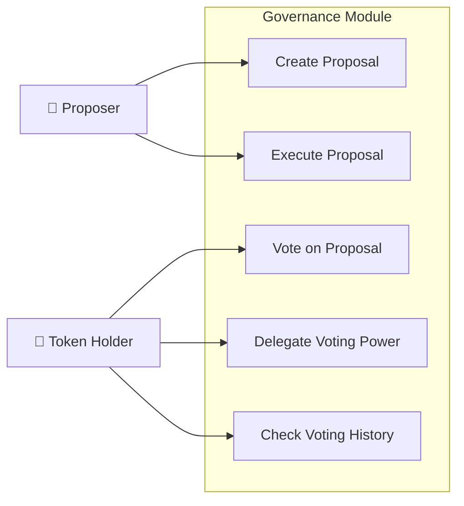
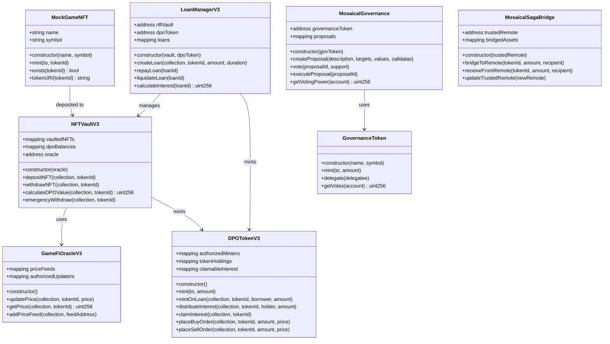
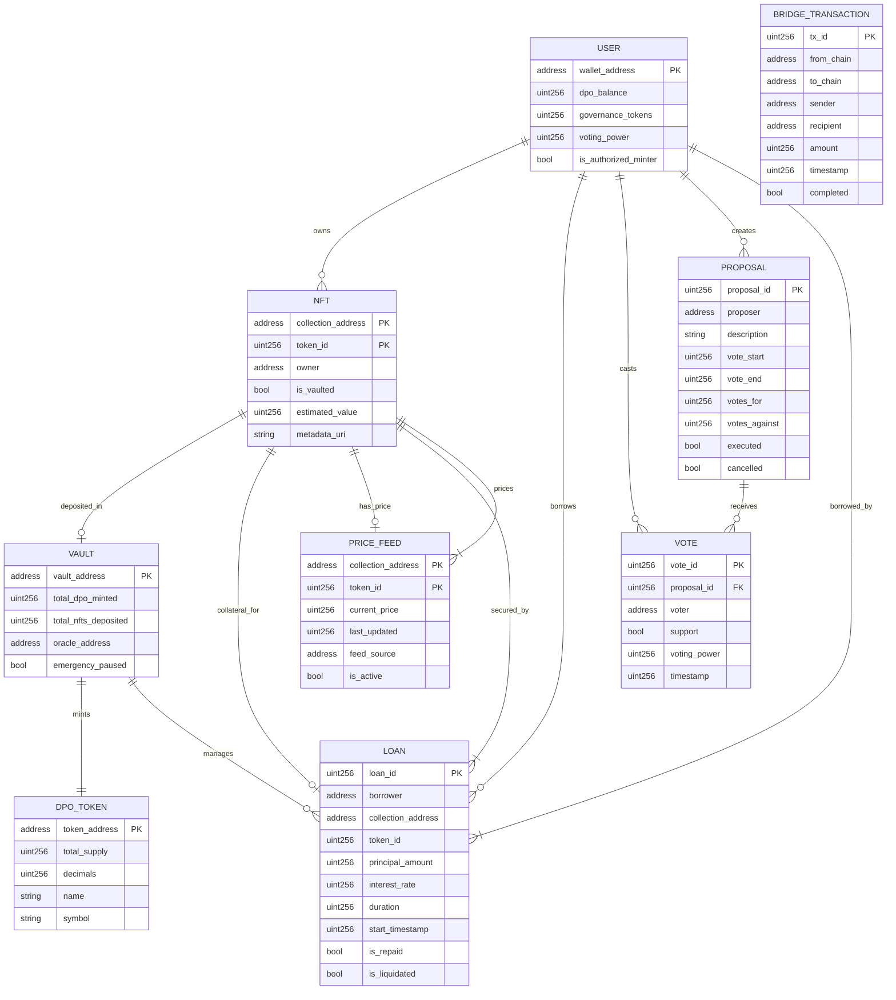

# Mosaical MVP - Decentralized NFT Fractionalization Platform

Mosaical là một nền tảng phi tập trung cho phép phân mảnh (fractionalize) NFT và tạo ra các token DPO (Diversified Portfolio Option) để giao dịch và đầu tư vào danh mục NFT đa dạng.

## 📋 Todo List

### ✅ Completed
- [x] Smart contract development (8 contracts)
- [x] Contract compilation system
- [x] Deployment scripts for Saga chainlet
- [x] Contract flattening for verification
- [x] Basic testing framework
- [x] Environment configuration

### 🔧 In Progress
- [ ] Contract verification on Saga Explorer
- [ ] Frontend development
- [ ] API integration
- [ ] Advanced testing scenarios

### 📅 Planned
- [ ] Oracle price feed integration
- [ ] Cross-chain bridge functionality
- [ ] Governance voting mechanism
- [ ] Staking rewards system
- [ ] Mobile application
- [ ] Audit and security review

## 🏗️ System Architecture



## 🎯 Core Features

### 1. NFT Fractionalization
- Deposit NFTs vào vault để nhận DPO tokens
- Phân mảnh ownership của high-value NFTs
- Liquidity mining và yield farming

### 2. Decentralized Finance (DeFi)
- Lending/borrowing với NFT collateral
- Interest distribution system
- Order book trading cho DPO tokens

### 3. Governance System
- Community voting trên protocol changes
- Proposal creation và execution
- Token-based voting power

### 4. Cross-chain Bridge
- Transfer assets giữa các chains
- Multi-chain NFT support
- Unified liquidity pools

## 📊 Functional Diagram



## 🎭 Use Case Diagram

### System Level Use Cases



### NFT Vault Module Use Cases



### Loan Manager Module Use Cases



### Governance Module Use Cases



## 🏛️ Class Diagram



## 📊 Entity Relationship Diagram



## 🚀 Quick Start

### 1. Environment Setup
```bash
# Copy environment template
cp .env.example .env

# Edit .env with your private key and network settings
```

### 2. Compile Contracts
```bash
# Using workflow button or command
npm run compile
# or
node scripts/compile.js
```

### 3. Deploy Contracts
```bash
# Deploy to Saga chainlet
npx hardhat run scripts/deploy.js --network devpros

# Deploy with JSON output
npx hardhat run scripts/deploy-with-json.js --network devpros
```

### 4. Verify Contracts
```bash
# Flatten contracts first
node scripts/flatten.js

# Manual verification on Saga Explorer
# Use flattened files in /flattened directory
```

### 5. Run Tests
```bash
npx hardhat test
```

## 📁 Project Structure

```
├── contracts/              # Smart contracts
│   ├── MockGameNFT.sol     # Example NFT contract
│   ├── NFTVaultV3.sol      # NFT vault for deposits
│   ├── DPOTokenV3.sol      # Fractionalized tokens
│   ├── LoanManagerV3.sol   # Lending protocol
│   ├── GameFiOracleV3.sol  # Price oracle
│   ├── MosaicalGovernance.sol # DAO governance
│   ├── GovernanceToken.sol # Voting tokens
│   └── MosaicalSagaBridge.sol # Cross-chain bridge
├── scripts/                # Deployment & utility scripts
├── test/                   # Test files
├── deployments/            # Deployment records
├── flattened/              # Flattened contracts for verification
└── .env.example           # Environment template
```

## 🌐 Network Configuration

### Saga Chainlet (devpros)
- **RPC URL**: `https://devpros-2749656616387000-1.jsonrpc.sagarpc.io`
- **Chain ID**: `2749656616387000`
- **Explorer**: `https://devpros-2749656616387000-1.sagaexplorer.io`
- **WebSocket**: `https://devpros-2749656616387000-1.ws.sagarpc.io`

### Contract Addresses (Latest Deployment)
```json
{
  "MockGameNFT": "0x165ABbf7859997e9Ebed825df101E313Db642dda",
  "GovernanceToken": "0x54bef235A25daC5B4386A05e25D37688C5379936",
  "GameFiOracleV3": "0x980F5eA0dc03175056BC041f4708C82B74d6E322",
  "NFTVaultV3": "0x869d9bF00823018f74854033040943A1ff5EFf60",
  "MosaicalGovernance": "0xd31E3D5e43E9945B4AF2aDD7f5a54C00E76b0991",
  "DPOTokenV3": "0x6d66483DC259783f4E4aDe90b1fAB01F8A876D2e",
  "LoanManagerV3": "0xC9D80AF77a91d7FB7A73189D1D97ABc29399460c",
  "MosaicalSagaBridge": "0x2FbA9CcF4930FB188a4A5A7a7bFC6aDBda0eb439"
}
```

## 🔧 Available Scripts

| Command | Description |
|---------|-------------|
| `npm run compile` | Compile smart contracts |
| `npm run deploy` | Deploy contracts to network |
| `npm run test` | Run test suite |
| `npm run flatten` | Generate flattened contracts |
| `npm run verify` | Verify contracts on explorer |

## 🛡️ Security Considerations

- All contracts use OpenZeppelin secure implementations
- Multi-signature requirements for critical operations
- Emergency pause mechanisms
- Oracle price manipulation protection
- Reentrancy guards on financial functions

## 📄 License

This project is licensed under the MIT License - see the [LICENSE](LICENSE) file for details.

## 🤝 Contributing

1. Fork the repository
2. Create your feature branch (`git checkout -b feature/AmazingFeature`)
3. Commit your changes (`git commit -m 'Add some AmazingFeature'`)
4. Push to the branch (`git push origin feature/AmazingFeature`)
5. Open a Pull Request

## 📞 Support

For support and questions:
- Create an issue in the repository
- Join our Discord community
- Follow our documentation

---

*Built with ❤️ on Saga Chainlet*
