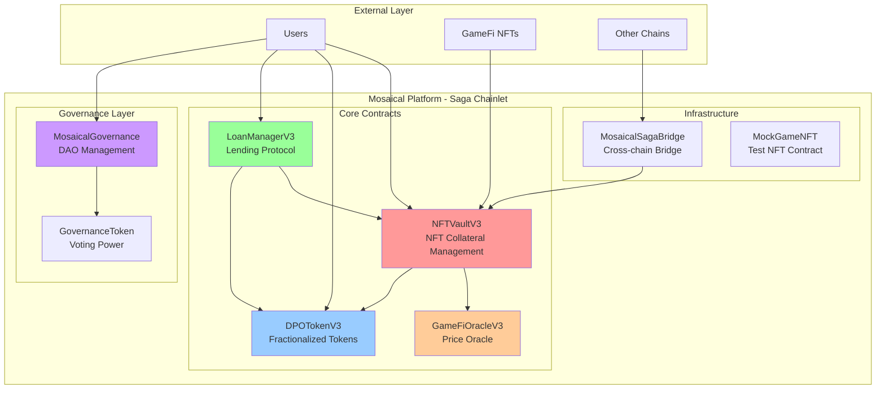
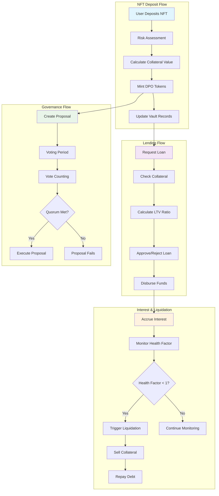
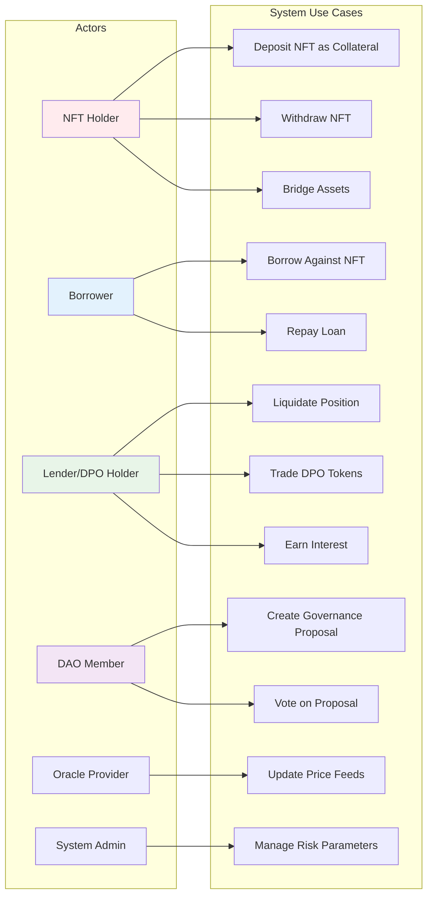
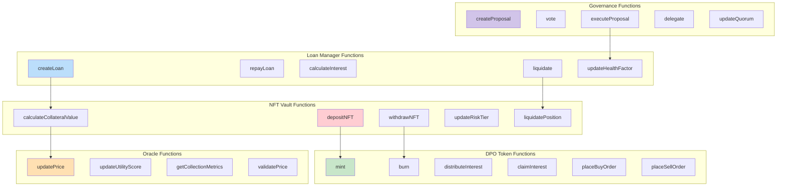
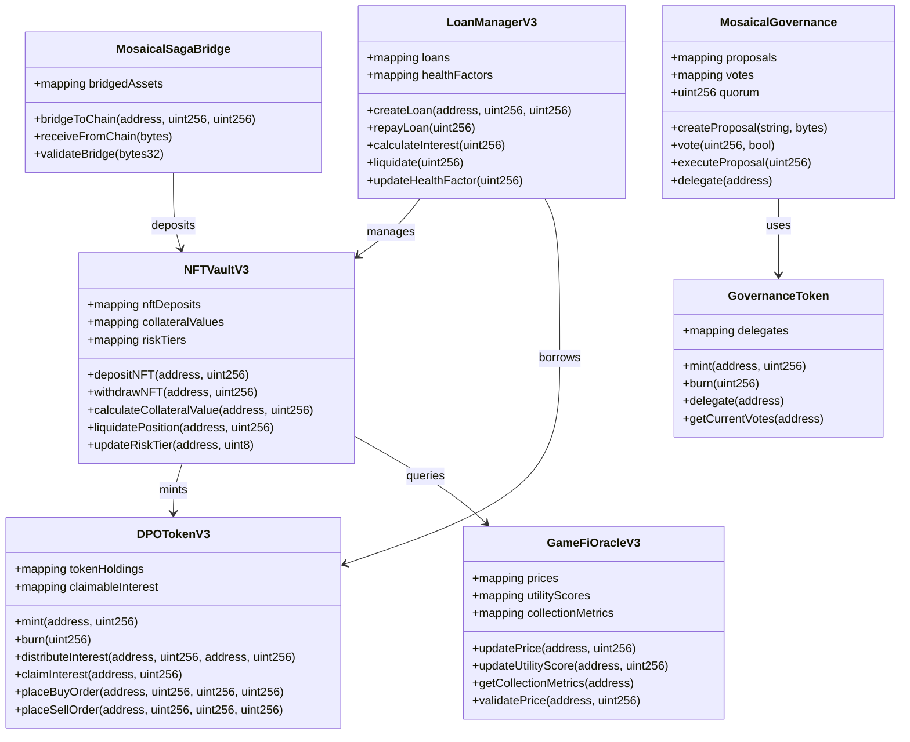
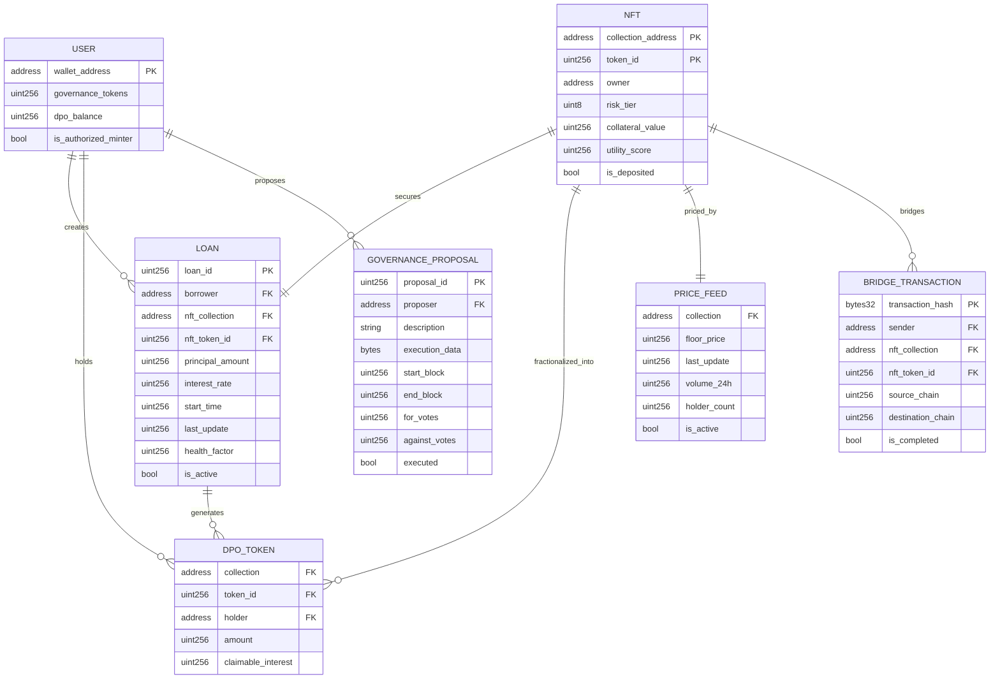

# Mosaical MVP - Decentralized NFT Fractionalization Platform

Mosaical is a decentralized platform that enables NFT fractionalization and creates DPO (Diversified Portfolio Option) tokens for trading and investing in diversified NFT portfolios.

## 🚀 Features

- **NFT Fractionalization**: Deposit NFTs into vaults to receive DPO tokens
- **Lending Protocol**: Borrow against NFT collateral with dynamic interest rates
- **Governance System**: Community-driven protocol governance with voting mechanisms
- **Cross-chain Bridge**: Transfer assets between different blockchain networks
- **Oracle Integration**: Real-time price feeds and utility scoring for GameFi NFTs
- **Risk Management**: Multi-tier risk models with liquidation protection

## 📊 System Architecture

The platform consists of 8 core smart contracts deployed on Saga Chainlet:

1. **MockGameNFT** - Example NFT contract for testing
2. **NFTVaultV3** - Core vault for NFT deposits and collateral management
3. **DPOTokenV3** - Fractionalized tokens with interest distribution
4. **LoanManagerV3** - Lending protocol with dynamic interest rates
5. **GameFiOracleV3** - Price oracle with utility scoring for GameFi assets
6. **MosaicalGovernance** - DAO governance with proposal and voting system
7. **GovernanceToken** - Voting tokens for protocol governance
8. **MosaicalSagaBridge** - Cross-chain bridge for asset transfers



## 🔄 Functional Diagram



## 🎯 Use Case Diagram

### System Level Use Cases



### Function Use Cases



## 🏗️ Class Diagram



## 🗄️ Entity Relationship Diagram



## 🌐 Network Information

### Saga Chainlet (devpros)
- **Network Name**: devpros
- **Chain ID**: 2749656616387000
- **RPC URL**: `https://devpros-2749656616387000-1.jsonrpc.sagarpc.io`
- **WebSocket**: `https://devpros-2749656616387000-1.ws.sagarpc.io`
- **Block Explorer**: `https://devpros-2749656616387000-1.sagaexplorer.io`

## 📋 Contract Addresses (Latest Deployment)

```json
{
  "MockGameNFT": "0xf92cd1A59e682a9Fb66f0145e5a8834cF79DA3Ea",
  "GovernanceToken": "0x035F76ef9Ca49fabCA7d6828018aAF491Ae52508",
  "GameFiOracleV3": "0x85dBc00b8F20A827820263aBC1Db8e8E48366FA2",
  "NFTVaultV3": "0x9B48478e076458E33Cef1aE2F07CF4E90723b7aa",
  "MosaicalGovernance": "0xE88278b409E72Da42C3E7b761a5fca9483303A53",
  "DPOTokenV3": "0x6Dc8eA402977576153d0Fabbc7C496765540bc7d",
  "LoanManagerV3": "0x9c1378C1993367cD5641bf2813AE14B95B581C73",
  "MosaicalSagaBridge": "0x050523005E61BD90780b545d65789d68DA86727f"
}
```

All contracts have been successfully verified on the Saga Explorer and are ready for interaction.

## 🏗️ Project Structure

```
├── contracts/              # Smart contracts
│   ├── MockGameNFT.sol     # Example NFT contract
│   ├── NFTVaultV3.sol      # NFT vault for deposits
│   ├── DPOTokenV3.sol      # Fractionalized tokens
│   ├── LoanManagerV3.sol   # Lending protocol
│   ├── GameFiOracleV3.sol  # Price oracle
│   ├── MosaicalGovernance.sol # DAO governance
│   ├── GovernanceToken.sol # Voting tokens
│   └── MosaicalSagaBridge.sol # Cross-chain bridge
├── scripts/                # Deployment & utility scripts
│   ├── deploy.js           # Main deployment script
│   ├── deploy-with-json.js # Deployment with JSON output
│   ├── verify.js           # Contract verification
│   ├── flatten.js          # Contract flattening
│   └── compile.js          # Contract compilation
├── test/                   # Test files
├── deployments/            # Deployment records
├── flattened/              # Flattened contracts for verification
└── .env.example           # Environment template
```

## 🚀 Quick Start

### 1. Environment Setup
```bash
# Copy environment template
cp .env.example .env

# Edit .env with your private key and network settings
```

### 2. Install Dependencies
```bash
npm install
```

### 3. Compile Contracts
```bash
# Using the Compile Contracts workflow
# or manually:
node scripts/compile.js
```

### 4. Deploy Contracts
```bash
# Deploy to Saga chainlet
npx hardhat run scripts/deploy.js --network devpros

# Deploy with JSON output
npx hardhat run scripts/deploy-with-json.js --network devpros
```

### 5. Verify Contracts
```bash
# Flatten contracts first
node scripts/flatten.js

# Run verification script
npx hardhat run scripts/verify.js --network devpros
```

### 6. Run Tests
```bash
npx hardhat test
```

## 🔧 Available Workflows

| Workflow | Description |
|----------|-------------|
| **Deploy Contracts** | Deploy all contracts to Saga chainlet |
| **Compile Contracts** | Compile smart contracts |
| **Verify Contracts** | Verify contracts on block explorer |
| **Deploy with JSON** | Deploy with JSON output for integration |
| **Run Tests** | Execute test suite |
| **Flatten Contracts** | Generate flattened contracts |

## 💼 Core Functionality

### NFT Vault Operations
- **Deposit NFT**: Lock NFTs to receive borrowing capacity
- **Withdraw NFT**: Reclaim NFTs after loan repayment
- **Risk Assessment**: Multi-tier risk models based on collection type

### Lending Protocol
- **Borrow**: Use NFTs as collateral to borrow DPSV tokens
- **Repay**: Repay loans with accrued interest
- **Liquidation**: Automated liquidation for underwater positions
- **Dynamic Interest**: Interest rates based on utilization and risk

### DPO Token Features
- **Fractionalization**: Represent fractional ownership of NFT portfolios
- **Interest Distribution**: Earn yield from protocol fees
- **Trading**: Buy/sell orders for secondary market liquidity
- **Governance Rights**: Participate in protocol decisions

### Governance System
- **Proposals**: Create proposals for protocol changes
- **Voting**: Token-weighted voting system
- **Execution**: Automated execution of passed proposals
- **Delegation**: Delegate voting power to other addresses

## 🛡️ Security Features

- **Multi-signature** requirements for critical operations
- **Emergency pause** mechanisms
- **Oracle price manipulation** protection
- **Reentrancy guards** on financial functions
- **Liquidation protection** with health factors
- **Risk-based LTV** ratios

## 📈 Risk Management

The protocol implements a 5-tier risk model:

| Tier | Max LTV | Liquidation Threshold | Target Collections |
|------|---------|----------------------|-------------------|
| 1    | 70%     | 80%                  | Blue-chip NFTs    |
| 2    | 65%     | 75%                  | Established GameFi |
| 3    | 60%     | 70%                  | Mid-tier collections |
| 4    | 55%     | 65%                  | New/experimental |
| 5    | 50%     | 60%                  | High-risk assets |

## 🎮 GameFi Integration

- **Utility Scoring**: On-chain utility scoring for GameFi NFTs
- **Collection Metrics**: Volume, holder count, and activity tracking
- **Dynamic Pricing**: Real-time floor price updates
- **Activity Monitoring**: Track in-game utility and engagement

## 🌉 Cross-chain Capabilities

- **Asset Bridging**: Transfer NFTs between supported chains
- **Unified Liquidity**: Cross-chain liquidity pools
- **Multi-chain Support**: Expandable to other blockchain networks
- **LayerZero Integration**: Secure cross-chain messaging

## 🧪 Testing

The project includes comprehensive tests covering:
- Contract deployment and initialization
- NFT deposit and withdrawal flows
- Lending and borrowing operations
- Governance proposal and voting
- Oracle price updates
- Bridge functionality

## 📝 Environment Variables

Required environment variables (see `.env.example`):

```bash
# Network Configuration
NETWORK=devpros
RPC_URL=https://devpros-2749656616387000-1.jsonrpc.sagarpc.io
PRIVATE_KEY=your_private_key_here

# Chainlet Information
CHAINLET_ID=devpros_2749656616387000-1
BLOCK_EXPLORER=https://devpros-2749656616387000-1.sagaexplorer.io
```

## 🔗 Links

- **Block Explorer**: [Saga Explorer](https://devpros-2749656616387000-1.sagaexplorer.io)
- **Deployment Records**: [saga-deployment.json](./deployments/saga-deployment.json)
- **Contract Source**: [Verified Contracts](https://devpros-2749656616387000-1.sagaexplorer.io)

## 🤝 Contributing

1. Fork the repository
2. Create your feature branch (`git checkout -b feature/AmazingFeature`)
3. Commit your changes (`git commit -m 'Add some AmazingFeature'`)
4. Push to the branch (`git push origin feature/AmazingFeature`)
5. Open a Pull Request

## 📄 License

This project is licensed under the MIT License - see the [LICENSE](LICENSE) file for details.

## 🆘 Support

For support and questions:
- Create an issue in the repository
- Check the deployment logs in `/deployments`
- Review contract interactions on Saga Explorer

---

*Built with ❤️ on Saga Chainlet - Powering the future of decentralized NFT finance*