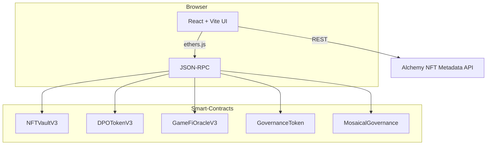
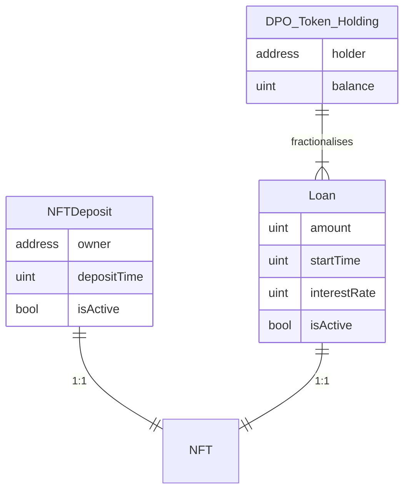
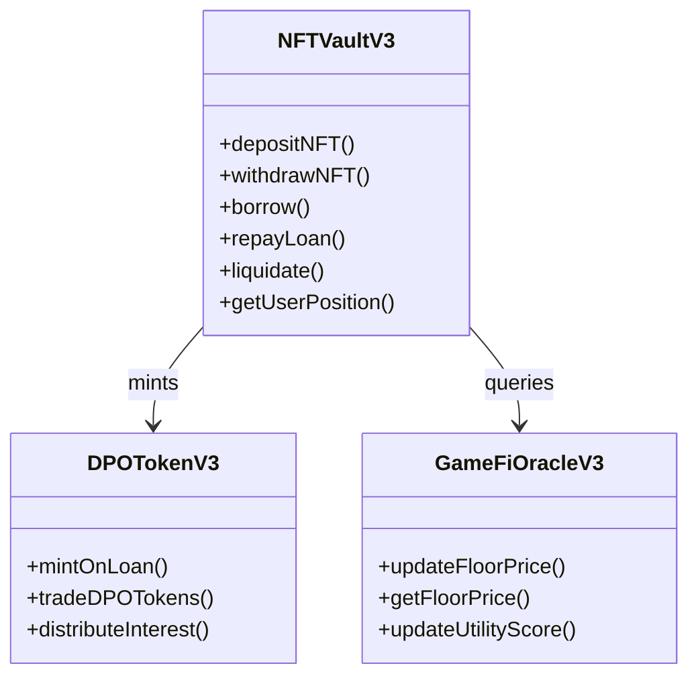
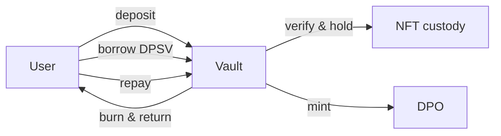
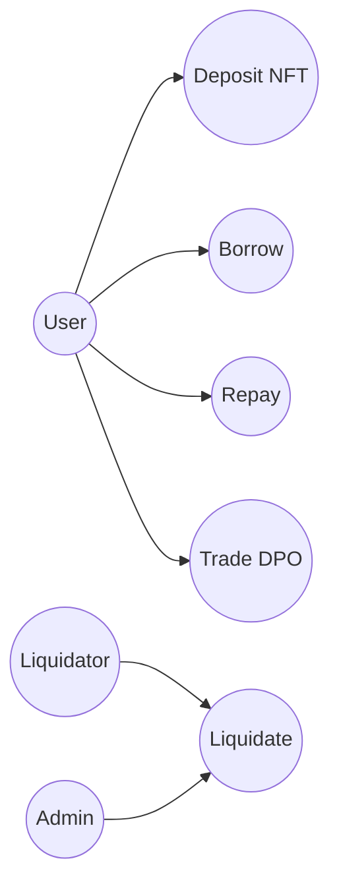
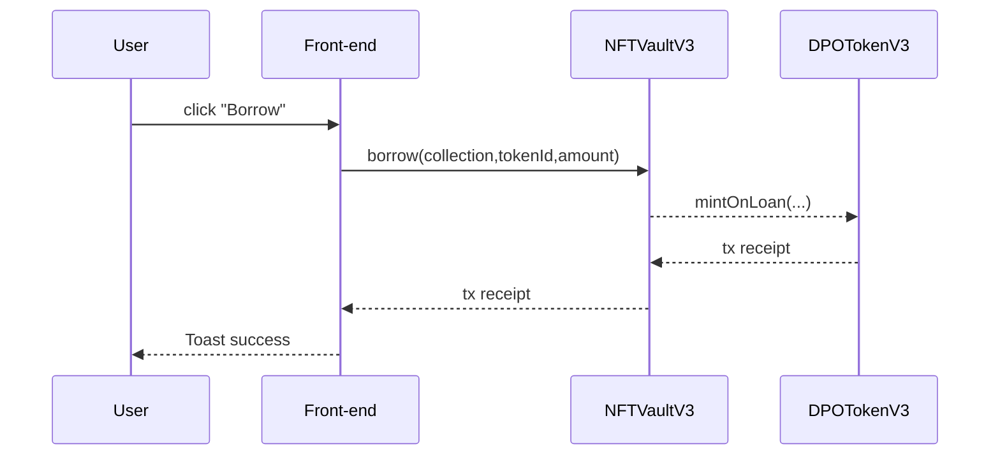
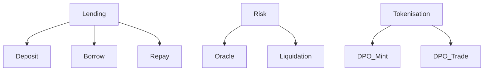

# Mosaical DeFi – Dynamic Yield-Backed NFT Financing

Mosaical is a GameFi–focused lending protocol that unlocks liquidity from in-game NFTs.  Depositors collateralise NFTs in the `NFTVaultV3` contract and borrow native chain currency (DPSV).  When a loan is opened the vault mints DPO (Debt Position Ownership) ERC-20 tokens that fractionalise the debt, making it tradable and enabling sophisticated secondary-market risk transfer.

---
## 0. Quick links

* 🖥 Demo front-end ‑ `frontend/`
* 🛠 Smart contracts ‑ `src/contracts/`

---
## 1. System architecture  _(design-first)_


---
## 2. Entity–Relationship Diagram (ERD)


---
## 3. Class diagram


---
## 4. Functional flow


---
## 5. Use-case diagrams
### 5.1 Overall actors


### 5.2 User-centric

```mermaid
flowchart LR
  %% Individual actor view – Borrower %%
  subgraph Borrower
    borrower((Borrower))
    bcDeposit((Deposit NFT))
    bcBorrow((Borrow))
    bcRepay((Repay))
    borrower --> bcDeposit
    borrower --> bcBorrow
    borrower --> bcRepay
  end

  %% Individual actor view – Lender/DPO Holder %%
  subgraph Lender
    lender((DPO Holder))
    lcTrade((Trade DPO))
    lcEarn((Claim Interest))
    lender --> lcTrade
    lender --> lcEarn
  end

  %% Individual actor view – Admin %%
  subgraph Admin
    adminActor((Admin))
    acUpdateOracle((Update Oracle))
    acManageParam((Manage Parameters))
    adminActor --> acUpdateOracle
    adminActor --> acManageParam
  end

  %% Individual actor view – Liquidator %%
  subgraph Liquidator
    liquidator((Liquidator))
    lcLiquidate((Liquidate))
    liquidator --> lcLiquidate
  end
```


---
## 6. Sequence – Borrow happy-path


---
## 7. Functional Decomposition


---
## 8. Checklist
| Feature | Status |
| --- | --- |
| Deposit / Withdraw NFT | ✅ done |
| Borrow & Repay native DPSV | ✅ done |
| DPO token mint on borrow | ✅ done |
| Trade DPO tokens | ✅ done (ERC-20 transfer) |
| Interest distribution | ⏳ pending |
| Liquidation engine | ⏳ pending |
| Governance voting | ❌ not yet |

---
## 9. Results
* End-to-end happy path validated on Devpros chainlet.
* Front-end race conditions fixed; gas exceptions resolved.

---
## 10. Limitations
* Oracle prices manually updated.
* Lack of on-chain order-book for DPO trading.
* Liquidation uses direct caller, no auction.

---
## 11. Road-map / Recommendations
1. Integrate off-chain price oracle (Chainlink, Pyth).
2. Implement Dutch-auction liquidation.
3. Secondary-market AMM pool for DPO tokens.
4. Governance module for protocol parameters.
5. Security audit.

## Các hợp đồng đã triển khai

<!-- Deployment addresses redacted for public repository -->

_Deployment addresses have been moved to `deployments/<env>-deployment.json` which is excluded via `.gitignore`._

## Thông tin mạng

<!-- Network details redacted -->

_Internal test-net parameters (name, RPC, chain ID, explorer) are intentionally omitted from public docs._

## Cách triển khai

Các hợp đồng đã được triển khai bằng cách sử dụng script `deploy-direct.js`. Script này:

1. Kết nối đến mạng Saga Devpros
2. Triển khai các hợp đồng theo thứ tự
3. Thiết lập mối quan hệ giữa các hợp đồng
4. Lưu thông tin triển khai vào file `deployments/devpros-deployment.json`

## Kiểm tra các hợp đồng

Để kiểm tra các hợp đồng đã triển khai, chạy:

```
node scripts/check-contracts.js
```

## Xác minh hợp đồng

Hiện tại, việc xác minh mã nguồn trên trình khám phá khối Saga gặp một số vấn đề. Để xem hướng dẫn xác minh thủ công, chạy:

```
node scripts/verify-manual.js
```

## Các chức năng chính

### MockGameNFT
- NFT trò chơi mẫu để thử nghiệm

### GovernanceToken
- Token quản trị cho hệ thống Mosaical

### GameFiOracleV3
- Oracle cung cấp dữ liệu về NFT trò chơi

### NFTVaultV3
- Kho lưu trữ và quản lý NFT

### MosaicalGovernance
- Hệ thống quản trị cho nền tảng Mosaical

### DPOTokenV3
- Token DPO (Diversified Portfolio Option) cho hệ thống 