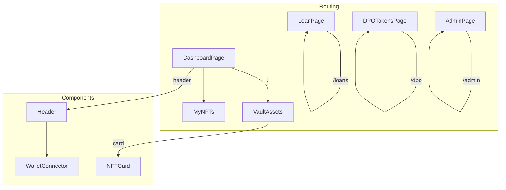
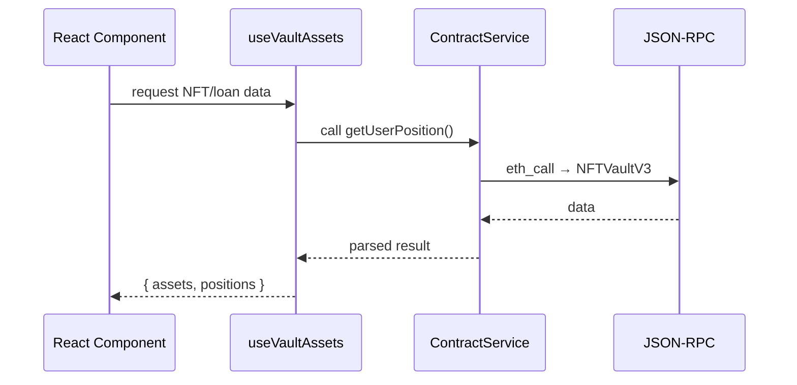

# Mosaical DeFi – Front-End (`frontend/`)

This package delivers the **single-page application (SPA)** that interacts with the Mosaical smart-contracts.  It lets players deposit NFTs, borrow & repay, trade DPO tokens and perform admin actions.

---
## 1  Tech stack
* **React 19** + **Vite 6** – ultra-fast dev server & build pipeline
* **Ethers.js 6** – blockchain RPC and contract ABIs
* **React-Bootstrap 5** – responsive UI components
* **Context API + custom hooks** – application state management

---
## 2  Application map


---
## 3  Important directories
| Path | Purpose |
|------|---------|
| `src/components/` | Reusable UI widgets (NFTCard, MyNFTs, WalletConnector…) |
| `src/pages/` | Top-level routed pages |
| `src/contexts/` | React Context providers (Web3 & Notification) |
| `src/hooks/` | Business-logic hooks (`useVaultAssets`, `useContracts`, `useWeb3`) |
| `src/services/` | Low-level helpers (`contractService`, `alchemyService`) |
| `src/constants/` | Contract addresses & network metadata |

---
## 4  Data/Control flow


---
## 5  Getting started
```bash
# install deps
cd frontend
npm install

# start hot-reload dev server on http://localhost:5173
npm run dev

# lint all files
npm run lint

# production build -> dist/
npm run build

# serve built bundle (uses Vite preview)
npm run preview -- --host --port 4173
```

Environment variables (create `.env.local`):
```
VITE_ALCHEMY_KEY=_____your_key_____
```
`src/services/alchemyService.js` reads this key – the file is ignored by Git via `.gitignore`.

---
## 6  UX guidelines
1. **Optimistic UI** – after Metamask confirms, state updates locally while tx is mined.
2. **Toast notifications** – success / error / pending tracked via `NotificationContext`.
3. **Two-column grid** – `VaultAssets` uses Bootstrap `Row g-4 Col xs=12 md=6` for responsive layout.

---
## 7  Checklist
- [x] Wallet connect / disconnect (MetaMask)
- [x] Deposit NFT
- [x] Borrow against NFT (Borrow modal)
- [x] Repay full loan (Repay modal)
- [x] Withdraw NFT (instant optimistic removal)
- [x] DPO token balance + transfer (Trade modal w/ Max button)
- [ ] Portfolio analytics dashboard _(pending)_
- [ ] Governance voting interface _(future)_

---
## 8  Known limitations
* Only one ERC-721 collection hard-coded in MVP (`MockGameNFT`).
* Oracle price must be pushed manually by admin.
* No automatic liquidation UI yet – admin executes from AdminPage.

---
## 9  Roadmap
1. Integrate WalletConnect & Ledger support.
2. Add charting dashboard with historical LTV / interest data.
3. Real-time oracle feed via WebSockets.
4. Multi-language i18n and accessibility pass.
